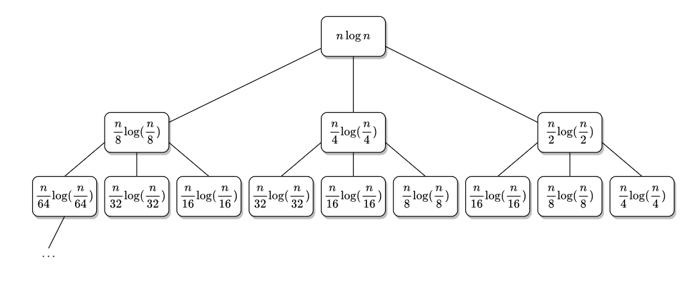
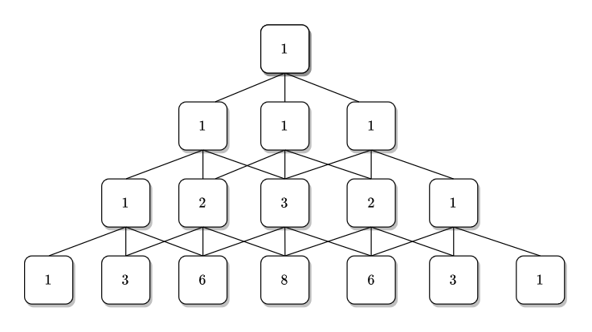

# Problem 5

> Refs & people discussed with:
>
> https://en.wikipedia.org/wiki/Trinomial_triangle
> b09902100

## (1) Asymptotic Notations

### (a)

$$
\begin{align}

\ln{n!} &= \sum_{i=1}^{n} \ln{i} \le \sum_{i=1}^{n} \ln{n} = n\ln{n} = \ln{n^n} \\
\Rightarrow \ln{n!} &= O(\ln{n^n})

\end{align}
$$

### (b)

$$
\begin{align}
n^{\ln c} &= (e^{\ln n})^{\ln c} = e^{\ln n \cdot \ln c} = c^{\ln n} \\
\Rightarrow n^{\ln c} &= \Theta(c^{\ln n})
\end{align}
$$

### (c)

Assume that $\sqrt{n} = O(n^{\sin{n}})$ is true, then $\exist\ n_0,\ c \gt 0$ such that $\forall\ n>n_0,\ \sqrt{n} \le c \cdot n^{\sin{n}}$.

Let $n_1 = \lceil \frac{c^2 + n_0}{\pi} \rceil \pi$, we have:

$$
\begin{align}
n_1 &\ge \frac{c^2 + n_0}{\pi} \pi = c^2 + n_0 \gt n_0 \\
\sqrt{n_1} &\ge \sqrt{\frac{c^2 + n_0}{\pi}\pi} = \sqrt{c^2 + n_0} \gt c \\
\sin{n_1} &= \sin({\lceil \frac{c^2 + n_0}{\pi} \rceil \pi}) = 0 \\
c \cdot {n_1}^{\sin{n_1}} &= c \cdot {n_1}^{0} = c \\
\Rightarrow \sqrt{n_1} &\gt c = c \cdot {n_1}^{\sin{n_1}}
\end{align}
$$

This conflicts with the assumption, therefore the assumption is false, $\sqrt{n} \ne O(n^{\sin{n}})$

### (d)

Let $f(x) = x-(\ln{x})^3$, we have:
$$
\begin{align}
f(x) &= x-(\ln{x})^3 \\
f'(x) &= 1 - \frac{3(\ln{x})^2}{x} = \frac{x-3(\ln{x})^2}{x}\\
f''(x) &=  - \frac{3(2\ln{x}-(\ln{x})^2)}{x^2} = \frac{3\ln{x}(\ln{x}-2)}{x^2}\\
\end{align}
$$
And:
$$
\begin{align}
f(e^6) &= e^6-6^3 = (e^2)^3-6^3 > 0 \\
f'(e^6) &= \frac{e^6-3\cdot6^2}{e^6} > \frac{e^6-6^3}{e^6} > 0 \\
f''(x) &= \frac{3\ln{x}(\ln{x}-2)}{x^2} > 0,\ \forall\ x > e^2 \\
\Rightarrow \forall\ x>e^6&,\ f(x) = x-(\ln{x})^3 > 0\ \\
\Rightarrow \forall\ x>e^6&,\ (\ln{x})^3 < x\\
\end{align}
$$
Choose $n_0= \lceil e^6 \rceil,\ c=1$: 
$$
\begin{align}
\forall\ n>n_0&,\ (\ln{n})^3 < c \cdot n \\
\Rightarrow (\ln{n})^3 &= o(n)
\end{align}
$$

---

## (2) Solve Recurrences

### (a)

$$
\begin{align}
T(n) &= 2T(n-1)+1 \\
&= 2(2T(n-2)+1)+1 = 2^2T(n-2)+3 \\
&= 2^2(2T(n-3)+1)+3 = 2^3 T(n-3) + 7 \\
&\dots \\
&= 2^k T(n-k) + (2^k-1) \\
&= 2^{n-2} T(n-(n-2)) + 2^{n-2}-1 \\
&= 2^{n-1}-1 \\
\Rightarrow T(n) &= \Theta(2^n)
\end{align}
$$

### (b)

The recursion tree looks like this:

Let $R_k$ be the sum of $k$-th row of the recursion tree.

$$
\begin{align}
R_1 &= n\log{n} \\
\\
R_2 &= \frac{n}{2}\log{(\frac{n}{2})} + \frac{n}{4}\log{(\frac{n}{4})} + \frac{n}{8}\log{(\frac{n}{8})} \\
&= \frac{7}{8}n\log{n} - \frac{(2^2\cdot1 + 2\cdot2 + 1\cdot3)\log{2}}{8}n \\
&= \frac{7}{8}n\log{n} - \frac{11\log{2}}{8} n \\
&\le \frac{7}{8}n\log{n} \\
\\
R_3 &= \frac{n}{4}\log{(\frac{n}{4})}
+ 2\cdot\frac{n}{8}\log{(\frac{n}{8})}
+ 3\cdot\frac{n}{16}\log{(\frac{n}{16})}
+ 2\cdot\frac{n}{32}\log{(\frac{n}{32})}
+ \frac{n}{64}\log{(\frac{n}{64})} \\
&= (\frac{7}{8})^2 n\log{n} - \frac{154\log2}{64}n \\
&\le (\frac{7}{8})^2n\log{n} \\
\\
R_k &\le (\frac{7}{8})^{k-1}n\log{n} \\
\\
\end{align}
$$

> To prove the coefficient of $n\log{n}$, we combine the same terms in each row, and look only at the coefficient:
>
> 
>
> This triangle is called "trinomial triangle".
> The $i$-th term in $j$-th row (both starts from $0$) is the coefficient of $x^i$ in $(1+x+x^2)^j$.
>
> Using $f(i,j)$ to denote the $i$-th term in $j$-th row in trinomial triangle, we can rewrite the $n\log{n}$ term in $k$-th row (starts from $1$) as:
> $$
> \begin{align}
> \sum_{i=0}^{2(k-1)} (f(i,k)\frac{n}{2^{3(k-1)-i}}\log{n})
> &= \sum_{i=0}^{2(k-1)} \frac{f(i,k)\cdot 2^i}{8^{k-1}}n\log{n} \\
> &= \frac{\sum_{i=0}^{2(k-1)} f(i,k)\cdot 2^i}{8^{k-1}}n\log{n} \\
> &= \frac{(1+2+2^2)^{k-1}}{8^{k-1}}n\log{n} \\
> &= (\frac{7}{8})^{k-1} n\log{n}
> \end{align}
> $$
> 

Then:
$$
\begin{align}
T(n) &\le \sum_{k=1}^{\infty} R_k \\
&\le \sum_{k=1}^{\infty} (\frac{7}{8})^{k-1}n\log{n} \\
&= \sum_{k=0}^{\infty} (\frac{7}{8})^kn\log{n} \\
&= \frac{1}{1-\frac{7}{8}} n \log n \\
\Rightarrow T(n) &= O(n\log n) \\
\end{align}
$$

And:

$$
\begin{align}
T(n) &\ge R_1 \\
&= n \log n \\
\Rightarrow T(n) &= \Omega(n\log n) \\
\end{align}
$$

Therefore, $T(n) = \Theta(n\log{n})$.

### (c)

Choose $n_1=e,\ c_1=1,\ \epsilon=0.5$
$$
\begin{align}
\forall\ n > n_1 &,\ n\log{n} \ge n \cdot 1 =  c_1 \cdot n \\
\Rightarrow n\log{n} &= \Omega(n^1) = \Omega(n^{(\log_4{2})+\epsilon})
\end{align}
$$
Choose $n_2 = 2,\ c_2=2$
$$
\begin{align}
\forall\ n>n_2,\ 4\cdot\frac{n}{2}\log{\frac{n}{2}} = 2n(\log{n}-\log2) \le 2n\log{n} = c_2 \cdot n\log{n}
\end{align}
$$
By case 3 of master theorem, $T(n)=\Theta(n\log{n})$

### (d)

$$
\begin{align}
n=2^m &\Rightarrow T(2^m) = 2^{m/2}T(2^{m/2})+2^m \\
F(m)=T(2^m) &\Rightarrow F(m) = 2^{m/2}F(\frac{m}{2})+2^m
\end{align}
$$

Let $\lg{x}=\log_2{x}$.

Claim: $F(m) \le (2\lg{m}) 2^m\ \forall\ m \ge 2$

For $m=2$, $F(2) = T(4) = 2 \cdot T(2) + 4 = 6 \le 2 \cdot 2^2 = 8$
If it's true for $m=k/2$:
$$
\begin{align}
F(k)
&= 2^{k/2} F(\frac{k}{2}) + 2^k \\
&\le 2^{k/2}(2(\lg{k}-\lg{2})2^{k/2}) + 2^k \\
&= (2\lg{k} )2^{k} - 2^k \\
&\lt (2\lg{k} )2^{k}
\end{align}
$$
By induction, $F(m) \le (2\lg{m}) 2^m\ \forall\ m \ge 2 \Rightarrow F(m) = O((\log{m})2^m)$.

Claim: $F(m) \ge (\lg{m}) 2^m\ \forall\ m \ge 2$

For $m=2$, $F(2) = T(4) = 2 \cdot T(2) + 4 = 6 \ge 2^2 = 4$
If it's true for $m=k/2$:
$$
\begin{align}
F(k)
&= 2^{k/2}F(\frac{k}{2})+2^k \\
&\ge 2^{k/2}((\lg{k}-\lg{2})2^{k/2}) + 2^k \\
&= (\lg{k} )2^{k} \\
\end{align}
$$
By induction, $F(m) \ge (\lg{m}) 2^m\ \forall\ m \ge 2 \Rightarrow F(m) = \Omega((\log{m})2^m)$.

$\Rightarrow F(m) = \Theta((\log{m})2^m) \Rightarrow T(2^m) = \Theta((\log{m})2^m) \Rightarrow T(n) = \Theta(n\log{\log{n}})$

---

