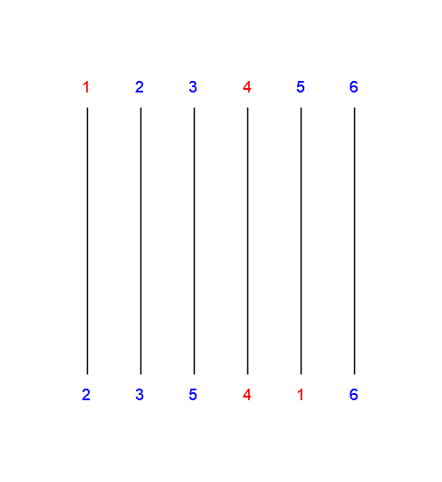

# Problem 6

> Refs & people discussed with:
>
> b09902100

## (1)

Use merge sort to sort the sequence $B$ and start with $|I(B)|=0$.
During the merging of two subarrays $A_1, A_2$, assuming $A_1$ is the one at front, each time when an element from $A_2$ is being merged, increase $|I(B)|$ by "$\#$ of elements in $A_1$ not merged yet".
After merge sort is done, $|I(B)|$ is also calculated.

## (2)

The time complexity of merge sort $T(N)$ has this recurrence relation: $T(N) = 2T(\frac{N}{2}) + O(N)\ \forall\ N\ge2$.
The extra calculation done for each merge is $O(N)$, because "$\#$ of elements in $A_1$ not merged yet" can be acquired by using a variable to store length of $A_1$ and substract by 1 when an element from $A_1$ is merged.

Adding this cost to the original recurrence relation yields my algorithm's recurrence relation: $T(N) = 2T(\frac{n}{2}) + 2\cdot O(N) = 2T(\frac{n}{2}) + O(N)$.

Because the recurrence relation is the same as merge sort, my algorithm also has the same time complexity $O(N\log{N})$.

## (3)

When an exchange happens during bubble sort, because it reverse a neighboring inversion, number of inversions decreases by $1$. And since the number of inversions in a sorted array is $0$, the total number of exchanges during bubble sort must be $|I(S)|$.

## (4)

1. Organize constraints as tuples. $(i,j)$ means when $i$ should go to $j$.

2. Loop through all starting points. If point $i$ isn't constrained, constrain it to the first finish point that hasn't been designated.

   For example, in this picture the constraints are $(1, 5),\ (4, 4)$. The rest of starting points will be assigned a finish point in order, that is, adding these constraints: $(2,1),\ (3,2),\ (5,3),\ (6,6)$.
   

3. Sort these tuples by the first element (starting point) with quick sort.

4. Apply the algorithm described in (1) to calculate the number of inversions.

5. The minimum number of horizontal lines needed is the number of inversions.

## (5)

When a horizontal line is added, the corresponding pair of lines exchange their finish point. This is similar to an exchange during bubble sort. We can think of a "constraint" as the initial position of an element in an unsorted array.

To use the minimal number of horizontal lines is to use the minimal number of exchanges, therefore other unconstrained starting points should have their finish points in the same relative order. And to calculate number of exchanges, we can apply the algorithm used to calculate the number of inversion, solving this problem in $O(N\log{N})$ time.

---

