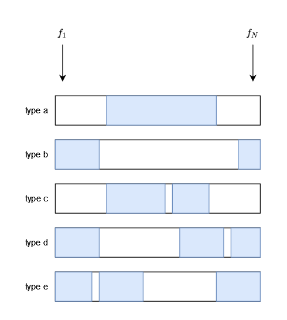

# Problem 7

> Refs & people discussed with
>
> https://ithelp.ithome.com.tw/articles/10221041
> b09902011 b09902100

## (1)

$16$

## (2)

### Algorithm

```pseudocode
function DP(f, N)
	max_ending = array(N)
	max_p = array(N)
	max_ending[2] = f[2]
	max_st[2] = 2
	sol = 2
	for i from 3 to N
		max_ending[i] = f[i]
		max_p[i] = i
		if (max_ending[i-1] + f[i] > max_ending[i])
			max_ending[i] = max_ending[i-1] + f[i]
			max_p[i] = max_p[i-1]
		if (max_ending[i] > max_ending[sol])
			sol = i
	return max_ending[sol], max_p[sol], sol

function solve(f, N)
	f_neg = array(N)
	sum_f = 0
	for i from 1 to N
		sum_f += f[i]
		f_neg = -f[i]
	max_sum, max_st, max_ed = DP(f, N)
	min_sum_neg, min_st, min_ed = DP(f_neg, N)
	if (max_sum >= sum_f + min_sum_neg)
		st, ed = max_st, max_ed
	else
		st, ed = min_ed+1, min_st-1
		if (st > N)
			st -= N
	return st, ed
```

The solution should be one of these two cases:

- If the solution doesn't include `f[1]`, the problem becomes finding maximum subarray of `f[2:N]`.
- If the solution does include `f[1]`, the rest of array should be the minimum subarray of `f[2:N]`, and the problem becomes finding minimum subarray of `f[2:N]`.

For finding maximum subarray:

1. Use an array `max_ending`, where `max_ending[i]` is the maximum sum of subarray ending at `f[i]`.
   And an array `max_p` to indicate the start of this subarray.
2. Build `max_ending` bottom up with this recurrence relation `max_ending[i] = max(f[i], max_ending[i-1]+f[i])`.
3. While building `max_ending`, use `sol` to store the index of maximum value in `max_ending`.
4. After the array is built, `sol` is the end of maximum subarray. Use `max_p` to get the start of maximum subarray.

Finding minimum subarray is essentially the same thing. We just use an array `f_neg` where each element is added a negative sign, then find the maximum subarray of `f_neg`.

Finally, we compare the answer of these two cases and choose the larger one.

### Time and space complexity

Each iteration of `for` in `DP()` takes constant time, so the entire `for` loop is takes $O(N)$ time, and `DP()` takes $O(N)+O(1)=O(N)$ time. Extra space used in `DP()` are `max_ending`, `max_p`, and `sol`, so it has $O(N)$ space complexity.

Time complexity of `solve()` is $2\cdot T(DP()) + O(N) +O(1) = 3\cdot O(N) + O(1) = O(N)$. Space complexity of `solve()` is $2\cdot S(DP()) + O(N) +O(1) = 3\cdot O(N) + O(1) = O(N)$

## (3)

The solution should be one of these five types:


The blue part marks the philosophers given tasty dishes.

1. For type a and b, simply apply the algorithm from the previous subproblem and save them as `sol_a` and `sol_b`. This step is done in $O(N)$ time and space.
   - While calculating type a, keep the array `max_ending` and rename it to `max_ending_fw`.
   - While calculating type b, also build an array `min_sub_fw` where `min_sub_fw[i]` is the sum of maximum subarray of **`f_neg[2:i]`** by saving the answer after each iteration.
   - Both of these adds only constant time to each iteration of `for`, therefore time complexity is still $O(N)$. `max_ending_fw` and `min_sub_fw` both take $O(N)$ space, so space complexity is still $O(N)$.
2. Do step 1 in the other direction, that is from `f[N]` to `f[1]`, and build `max_ending_bw` and `min_sub_bw`. This step is also done $O(N)$ time and space.
3. For type c, do the following:
   1. Go through each case that `f[i]` is skipped for `i` from `3` to `N-2`. The corresponding subarray sum is `max_ending_fw[i-1] + max_ending_bw[i+1]`, that is "maximum sum of subarray ending at `f[i-1]`" plus "maximum sum of subarray starting at `f[i+1]`".
   2. Store the maximum value of that, and it will be the maximum type c solution `sol_c`.
   3. All of this is done in $O(N)$ time and $O(1)$ space.
4. For type d, do the following:
   1. The target is to find minimum sum for the white part. We do this by calculating the maximum sum of that in `f_neg`.
   2. Go through each case that `f[i]` is skipped for `i` from `3` to `N`. The corresponding subarray sum is `f_neg[i] + min_sub_fw[i-1]`.
   3. Store the maximum value of that as `sol_tmp_d`. The sum of blue part `sol_d`, which is what we really want, is calculated by `sol_d = sum(f)+sol_tmp_d`.
   4. All of this is done in $O(N)$ time and $O(1)$ space.
5. For type e, because it's just type d mirrored, so the same steps can be applied with `min_sub_bw`, giving us `sol_e`. So this is also done in $O(N)$ time and $O(1)$ space.
6. Finally, find the maximum value from these five solutions. All steps together are done in $O(N)$ time and space.

To know the exact segment, we can use an extra array for each `max_*`, `min_*` array, where `i`-th element indicates the other end of the subarray that has this sum. This can be maintained similar to `max_p` in the previous subproblem, and the total time and space complexity don't change.

