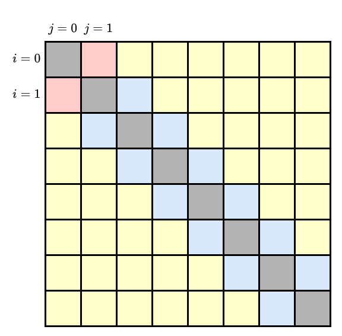

# Problem 5

> Refs:
> 
> None

## Subproblem (a)

### (1)

$$
dp(i,j) = 
\begin{cases}
dp(i,j-1) + E(j, j-1)
& \text{if $i<j-1$} & (\text{Case 1})\\

dp(i-1,j) + E(i-1, i)
& \text{if $j<i-1$} & (\text{Case 2})\\

E(1,0)
& \text{if $(i,j)=(0,1)$} & (\text{Case 3})\\

E(0,1)
& \text{if $(i,j)=(1,0)$} & (\text{Case 4})\\

\min_{0 \le k \le j-2}(dp(i,k)+E(j,k))
& \text{if $i=j-1$, $i\ne0$} & (\text{Case 5}) \\

\min_{0 \le k \le i-2}(dp(k,j)+E(k,i))
& \text{if $j=i-1$, $j\ne0$} & (\text{Case 6}) \\
\end{cases}
$$

#### Case 1

Because $i<j-1$ and all points from $S_0$ to $S_j$ must be chosen,  $S_{j-1}$ must be the second point on the way back. The path for $dp(i,j)$ should be something like this:

$$
S_0 \to \text{some points} \to S_i \to S_N \to S_j \to S_{j-1}
\to \text{some other points} \to S_0
$$

We need to minimize the energy spent on $S_0 \to S_i$ and $S_{j-1} \to S_0$  combined. And $dp(i,j-1)$ does exactly that. Therefore $dp(i,j) = dp(i,j-1) + E(j, j-1)$.

#### Case 2

Because $j<i-1$ and all points from $S_0$ to $S_i$ must be chosen,  $S_{i-1}$ must be the second last point on the way go. The path for $dp(i,j)$ should be something like this:

$$
S_0 \to \text{some points} \to S_{i-1} \to S_i \to S_N \to S_j
\to \text{some other points} \to S_0
$$

We need to minimize the energy spent on $S_0 \to S_{i-1}$ and $S_j \to S_0$ combined. And $dp(i-1,j)$ does exactly that. Therefore $dp(i,j)=dp(i-1,j) + E(i-1, i)$.

#### Case 3 & 4

These two cases are just base cases. Their paths are:

$$
S_0 \to S_N \to S_1 \to S_0 \text{ and } S_0 \to S_1 \to S_N \to S_0
$$

Therefore $dp(0,1)=E(1,0)$ and $dp(1,0) = E(0,1)$.

#### Case 5

In this case, the path should be something like this:

$$
S_0 \to \text{some points} \to S_i = S_{j-1}
\to S_N \to S_j \to S_k \to \text{some other points} \to S_0
$$

Because there are no guarantee of $S_j$'s next point, we choose the $\min$ of all possible cases, that is, from $j-2$ to $0$. Therefore $dp(i,j) = \min_{0 \le k \le j-2}(dp(i,k)+E(j,k))$

#### Case 6

$$
S_0 \to \text{some points} \to S_k \to S_i
\to S_N \to S_j=S_{i-1} \to \text{some other points} \to S_0
$$

Similar to case 5, because there are no guarantee of $S_i$'s previous point, we choose the $\min$ of all possible cases. Therefore $dp(i,j)=\min_{0 \le k \le i-2}(dp(k,j)+E(k,i))$

#### Time complexity



We can store $dp(i,j)$ in an 2d array like the picture above. Case 1 and 2 are the yellow ones. Case 3 and 4 are the red ones. Case 5 and 6 are the blue ones. Fill the array from left to right, then top to bottom.

The red ones can be directly calculated in $O(1)$ time, and there are $2$. The yellow ones can be generated with the box on the left (or above for the bottom left half) in $O(1)$ time, and there are $O(N^2)$ yellow boxes. The blue ones can be calculated in $O(N)$ time with all values on the left (or above for the bottom left half), and there are $O(N)$ blue boxes.

The total time complexity is $2 \cdot O(1) + O(N^2) \cdot O(1) + O(N) \cdot O(N) = O(N^2)$.

---

### (2)

#### Explanation

Because every point in between must be visited exactly once in a valid path, $S_{N-1}$ must be on the way go or back. And because no turning back in the middle is allowed, $S_{N-1}$ must be either the last point on the way go or the first point on the way back. Therefore the optimal path must be $dp(N-1, k)$ or $dp(k, N-1)$ for some $k$.

The minimal cost is:

$$
C=\min_{0 \le k\le N-2}(dp(N-1, k)+E(N-1,N)+E(N,k),\ dp(k, N-1)+E(k,N)+E(N,N-1))
$$

When computing $dp(i,j)$, we don't need to save the entire table. We can keep only the current row, previous row, min of $dp(k,j)+E(k,j+1)$ of each column, reducing the space complexity to only $O(N)$.

#### Pseudocode

```pseudocode
function solve_cost(N)
    prev_row = array(N)
    cur_row = array(N)
    col_min = array(N) with value INF
    cost_min = INF
    for i from 0 to N-1
        row_min = INF
        for j from 0 to N-1
            if i == j
                continue
            if i < j
                if i < j-1 /* Case 1 */
                    cur_row[j] = cur_row[j-1]+E(j,j-1)
                else if i==0 and j==1 /* Case 3 */
                    cur_row[j] = E(1,0)
                else /* Case5 */
                    cur_row[j] = row_min
                /* Update min for case 6 */
                col_min[j] = min(col_min[j], cur_row[j] + E(i, j+1))
            else
                if j < i-1 /* Case 2 */
                    cur_row[j] = prev_row[j] + E(i-1, i)
                else if i==1 and j==0 /* Case 4 */
                    cur_row[j] = E(0,1)
                else /* Case 6 */
                    cur_row[j] = col_min[j]
                /* Update min for case 5 */
                row_min = min(row_min, cur_row[j] + E(i+1,j))

            prev_row[j] = cur_row[j]
            if i == N-1
                cost_min = min(cost_min, cur_row[j] + E(N-1,N) + E(N,j))
            if j == N-1
                cost_min = min(cost_min, cur_row[j] + E(i,N) + E(N,N-1))
    return cost_min
```

Rewrite case 5 and 6 into:

$$
dp(i,j) = 
\begin{cases}

\min_{0 \le k \le i-1}(dp(i,k)+E(i+1,k))
& \text{if $i=j-1$, $i\ne0$} \\

\min_{0 \le k \le j-1}(dp(k,j)+E(k,j+1))
& \text{if $j=i-1$, $j\ne0$} \\
\end{cases}
$$

---

### (3)


Since every yellow boxes must come from the left (or above for the bottom left half), and red boxes are base cases, only blue boxes' previous condition needs extra spaces to keep track of. And because there are $O(N)$ blue boxes, we only need $O(N)$ extra space to track their previous conditions.

The optimal path can be obtained by:

1. Solve the minimal cost
   - While solving minimal cost, use an extra array `parent` to store where each blue boxes comes from.
   - Also while solving minimal cost, when `cost_min` is updated, record which $(i,j)$ combination it is, and return it.
2. Create a list `path` containing only $S_N$
3. While $(i,j)\ne(1,0) \text{ or }(0,1)$
   - While $|i-j| > 1$
     - If $i>j$, add $i$ to `path` front, and decrease it by $1$.
     - If $j>i$, add $j$ to `path` back, and decrease it by $1$.
   - Use the array `parent` to obtain previous condition, and add the larger one(between original $i,j$) to `path`'s front/back.
4. Add $1$ to `path` front if $(i,j)=(1,0)$. Add $1$ to `path` back if $(i,j)=(0,1)$.
5. Add $0$ to front and back.
6. The list `path` is the optimal path.

Space complexity is $O(N) \text{ (solving minimal cost)} + O(N) \text{ (extra variables used)}=O(N)$.

Summing time complexity for each step is $O(N^2)+O(1)+O(N)+O(1)+O(1)=O(N^2)$.

---

## Subproblem (b)

### (1)

$dp(i,j,h)$: The minimal cost of $path(i,j)$ with $h$ health remaining. $dp(i,j,h)=\infty$ if there are no possible path or $h\le0$.

$$
dp(i,j,h) = 
\begin{cases}

\infty
& \text{if $h>H$ or $h\le0$} & (\text{Impossible})\\

dp(i,j-1,h) + E(j, j-1)
& \text{if $i<j-1$} & (\text{Case 1})\\

dp(i-1,j,h+D_i) + E(i-1, i)
& \text{if $j<i-1$} & (\text{Case 2})\\

E(1,0)
& \text{if $(i,j)=(0,1)$, $h=H$} & (\text{Case 3})\\

\infty
& \text{if $(i,j)=(0,1)$, $h\ne H$} & (\text{Impossible})\\

E(0,1)
& \text{if $(i,j)=(1,0)$, $h=H-D_1$} & (\text{Case 4})\\

\infty
& \text{if $(i,j)=(1,0)$, $h\ne H-D_1$} & (\text{Impossible})\\

\min_{0 \le k \le j-2}(dp(i,k,h)+E(j,k))
& \text{if $i=j-1$, $i\ne0$} & (\text{Case 5})\\

\min_{0 \le k \le i-2}(dp(k,j,h+D_i)+E(k,i))
& \text{if $j=i-1$, $j\ne0$} & (\text{Case 6})\\
\end{cases}
$$

---

### (2)

We can think of case 1, 2, 5, 6 as adding one more path to a path. This added point is marked red below:

$$
S_0 \to \text{some points} \to S_i \to S_N \to \textcolor{red}{S_j} \to S_{j-1}
\to \text{some other points} \to S_0 \\
S_0 \to \text{some points} \to S_{i-1} \to \textcolor{red}{S_i} \to S_N \to S_j
\to \text{some other points} \to S_0 \\
S_0 \to S_N \to S_1 \to S_0 \\
S_0 \to S_1 \to S_N \to S_0 \\
S_0 \to \text{some points} \to S_i = S_{j-1}
\to S_N \to \textcolor{red}{S_j} \to S_k \to \text{some other points} \to S_0 \\
S_0 \to \text{some points} \to S_k \to \textcolor{red}{S_i}
\to S_N \to S_j=S_{i-1} \to \text{some other points} \to S_0 \\
$$

#### Case 1

Because the added point is on the way back, the health is the same, therefore $dp(i,j,h)=dp(i,j-1,h) + E(j, j-1)$.

#### Case 2

Because the added point is on the way go, the health in previous state is higher, therefore $dp(i,j,h)=dp(i-1,j,h+D_i) + E(i-1, i)$.

#### Case 3 & 4

These two are base cases, and the path is shown above.

#### Case 5

Because the added point is on the way back, and there are no guarantee of $k$, $dp(i,j,h)=\min_{0 \le k \le j-2}(dp(i,k,h)+E(j,k))$

#### Case 6

Because the added point is on the way go, and there are no guarantee of $k$, $dp(i,j,h)=\min_{0 \le k \le i-2}(dp(k,j,h+D_i)+E(k,i))$

#### Time Complexity

We can use an array $DP[N][N][H]$ to store the value of $dp(i,j,h)$. Fill the array from a large $h$ to smaller $h$. And for each $h$, fill the 2d array row by row.


In each layer, there are $O(N)$ boxes (blue ones) that need $O(N)$ time to fill, and $O(N^2)$ boxes (red and yellow ones) that need $O(1)$ time to fill. There fore each layer takes $O(N^2)$ time.

The entire $DP[N][N][H]$ has $H$ layers of this kind of 2d array, so total time complexity is $H\cdot O(N^2)=O(HN^2)$.
